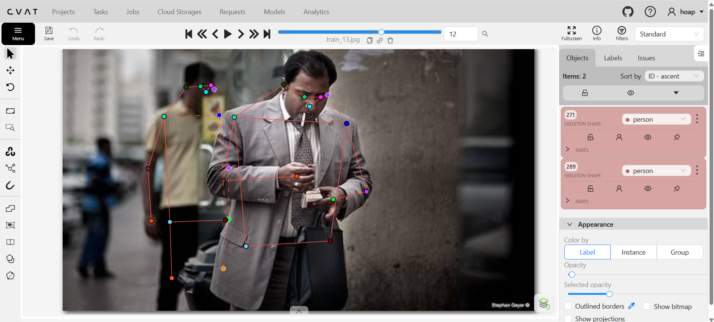
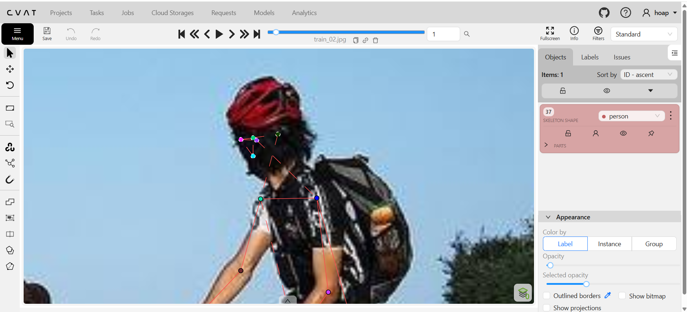
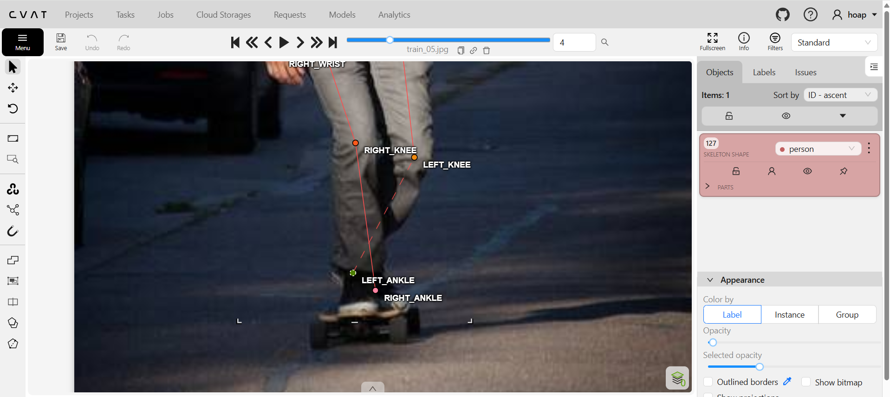
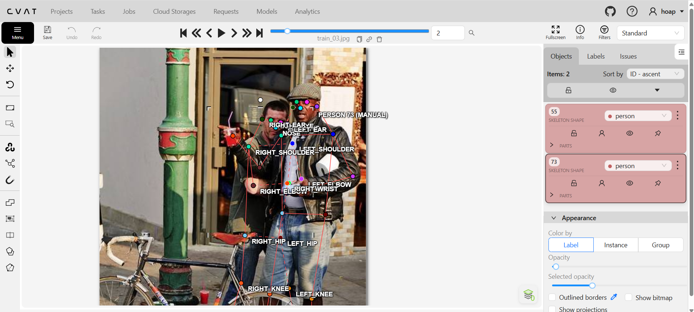

# Mini guideline - nhóm: ______  |  người gán: ______  |  ngày: ______

> Điền file này **trong lúc** gán nhãn, không phải sau khi xong. Mỗi lần bạn dừng lại
> hơn 10 giây để phân vân, đó là một dòng phải ghi vào đây.

## 1. Luật bắt buộc (đã thống nhất cả lớp - không sửa)

- Bộ 17 điểm COCO, đúng tên, đúng thứ tự. Lấy từ file `.SVG` chung.
- Mọi người trong ảnh đều có **đủ 17 điểm**. Điểm không dùng được thì gắn cờ, không xoá.
- Trái/phải tính theo **cơ thể người**, không theo bức ảnh.
- Bị che, còn trong khung -> `v = 1`, **vẫn đặt chấm** ở vị trí ước lượng.
- Ra ngoài mép ảnh -> `v = 0`, **không** đặt chấm.
- Không dùng `Hidden` (`h`) - nó không được lưu vào file.

## 2. Luật của nhóm bạn (phải điền)

| Tình huống | Luật nhóm bạn chọn | Vì sao | Minh chứng |
| --- | --- | --- | --- |
| Hông của người mặc quần áo dài | Vẫn vẽ, để visible và khoảng cách dựa vào ước lượng thân người | Dễ ước lượng chính xác theo tỷ lệ giải phẫu cơ thể. |  |
| Tai bị tóc hoặc mũ bảo hiểm che một phần | Vẫn vẽ, để occluded và ước lượng/đoán vị trí của bộ phận | Bị che khuất nhưng vẫn định vị rõ theo mắt và mũi. |  |
| Người bị cắt ở mép ảnh (chỉ thấy từ hông trở lên) | Các bộ phận nằm ngoài khung hình để outside | Khớp ngoài khung, không có pixel nên không bịa điểm. |  |
| Cổ tay nằm sau tay lái / sau thân mình | Vẫn vẽ, để occluded và ước lượng/đoán vị trí của bộ phận | Suy đoán chính xác theo hướng cẳng tay và tư thế. |  |
| Hai người chồng lên nhau | Vẽ những phần có thể nhìn thấy của người phía sau, nếu số khớp quá ít (dưới 5 khớp) thì không vẽ người đó | Dưới 5 khớp không đủ ngữ cảnh, cố đoán sẽ gây nhầm người. |  |
| Người nhỏ đến mức nào thì không gán nữa | Bỏ qua, không vẽ người đó (chiều cao < 30px hoặc các khớp dính vào nhau) | Khớp bị dính, thiếu độ phân giải khiến model học sai. |  |

Với mỗi luật, chèn **một ảnh mẫu** (screenshot từ CVAT) thay vì chỉ viết một câu.
Slide 12 nói rõ: khớp không có bề mặt nhìn thấy được thì phải có ảnh mẫu, không phải
một câu văn chung chung.

## 3. Ba ca mơ hồ đã gặp (bắt buộc, ghi ít nhất 3)

### Ca 1 - ảnh `train_02`, người thứ `1`, khớp `khuôn mặt`

- Mơ hồ ở chỗ nào: người đạp xe quay đầu về phía sau, khiến toàn bộ khuôn mặt bị che hoàn toàn
- Bạn quyết thế nào: vẫn vẽ và ước lượng vị trí của các bộ phận trong khuôn mặt (để occluded, v=1)
- Vì sao: Vì phần đầu khá nhỏ, nên có thể ước lượng vị trí của các bộ phận khuôn mặt trong phần đầu mà không ảnh hưởng quá nhiều
- Nếu người khác quyết ngược lại thì model học sai cái gì: Nếu để outside (v=0), model mất khả năng định vị đầu khi nhìn từ phía sau; nếu để visible (v=2), model học nhầm gáy/mũ thành mắt mũi.

### Ca 2 - ảnh `train_06`, người thứ `1`, khớp `các khớp thuộc nửa người phải`

- Mơ hồ ở chỗ nào: người đàn ông đang lái xe, khiến nửa người phải bị khuất sau chiếc xe
- Bạn quyết thế nào: vẽ và ước lượng vị trí của các khớp dựa vào nửa người nhìn thấy và kích thước của vai, xe (để occluded, v=1)
- Vì sao: Khớp vẫn nằm trong khung hình, dễ suy luận theo tính đối xứng cơ thể và tư thế ngồi lái xe.
- Nếu người khác quyết ngược lại thì model học sai cái gì: Nếu để outside (v=0), model học cụt một bên khung xương, không học được tính đối xứng cơ thể khi bị vật cản che.

### Ca 3 - ảnh `train_11`, người thứ `1`, khớp `nửa thân dưới`

- Mơ hồ ở chỗ nào: người phụ nữ ngồi bị con mèo và bàn che nửa thân dưới, điều mơ hồ là không biết là hông và đầu gối có nằm ở trong khung hình hay không để đánh outside và occluded
- Bạn quyết thế nào: vẽ ước lượng sơ bộ về phần hông và đầu gối (occluded, v=1), phần bàn chân đánh outside (v=0)
- Vì sao: Theo tỷ lệ dáng ngồi, hông và đầu gối vẫn trong vùng dưới bàn; cẳng/bàn chân đã vượt quá mép dưới ảnh.
- Nếu người khác quyết ngược lại thì model học sai cái gì: Nếu cố chấm bàn chân vào ảnh, model học co cụm chân giả tạo (hallucination); nếu để hông là outside, model mất khớp nối trọng tâm cơ thể.

## 4. Sau khi so visibility report với bạn cùng nhóm

- Khớp lệch `%v=1` nhiều nhất: `______` (bạn `___%` / họ `___%`)
- Nguyên nhân là **guideline chưa rõ** hay **một trong hai bên gán sai**:
- Luật mới bổ sung vào mục 2 sau khi thống nhất:
